# System Architecture Analysis
<!-- generated in 0.00s -->

## Overview

- **Project**: /home/tom/github/subactor/twin-developer
- **Primary Language**: json
- **Languages**: json: 28, typescript: 22, md: 19, python: 11, shell: 6
- **Analysis Mode**: static
- **Total Functions**: 294
- **Total Classes**: 40
- **Modules**: 93
- **Entry Points**: 211

## Architecture by Module

### src.cli
- **Functions**: 69
- **Classes**: 2
- **File**: `cli.ts`

### src.llm.client
- **Functions**: 28
- **Classes**: 3
- **File**: `client.ts`

### src.twin.validate
- **Functions**: 25
- **Classes**: 1
- **File**: `validate.ts`

### llm_service.core
- **Functions**: 22
- **Classes**: 4
- **File**: `core.py`

### src.extract.deterministic
- **Functions**: 21
- **Classes**: 1
- **File**: `deterministic.ts`

### src.reality.offer
- **Functions**: 15
- **Classes**: 3
- **File**: `offer.ts`

### src.twin.guidelines
- **Functions**: 15
- **Classes**: 1
- **File**: `guidelines.ts`

### src.ingest.markdown
- **Functions**: 14
- **File**: `markdown.ts`

### src.node-shims.d
- **Functions**: 13
- **File**: `node-shims.d.ts`

### src.twin.aggregate
- **Functions**: 9
- **File**: `aggregate.ts`

### src.ingest.cursor
- **Functions**: 9
- **Classes**: 1
- **File**: `cursor.ts`

### src.util.files
- **Functions**: 9
- **File**: `files.ts`

### src.util.text
- **Functions**: 9
- **File**: `text.ts`

### src.util.command
- **Functions**: 9
- **Classes**: 1
- **File**: `command.ts`

### src.ingest.common
- **Functions**: 7
- **File**: `common.ts`

### src.ingest.jsonl
- **Functions**: 6
- **File**: `jsonl.ts`

### llm_service.cli
- **Functions**: 5
- **File**: `cli.py`

### llm_service.app
- **Functions**: 5
- **File**: `app.py`

### src.ingest.shell
- **Functions**: 5
- **File**: `shell.ts`

### src.ingest.plain
- **Functions**: 5
- **File**: `plain.ts`

## Key Entry Points

Main execution flows into the system:

### scripts.check-schema-identity.main
- **Calls**: sorted, sorted, print, SCHEMAS.glob, json.loads, scripts.check-schema-identity.walk, None.glob, None.get

### llm_service.cli.main
- **Calls**: None.parse_args, llm_service.cli._write, llm_service.cli.parser, llm_service.core.health, llm_service.core.complete_intents, llm_service.cli._write, llm_service.cli._read, llm_service.core.complete_guidelines

### src.extract.deterministic.extractDeterministicRules
- **Calls**: src.extract.deterministic.filter, src.extract.deterministic.eventMatches, src.extract.deterministic.set, src.extract.deterministic.get, src.extract.deterministic.push, src.extract.deterministic.some, src.extract.deterministic.max, src.extract.deterministic.effectiveClass

### scripts.check-flag-parity.main
- **Calls**: scripts.check-flag-parity.routing_flags, scripts.check-flag-parity.env_example_values, sorted, None.read_text, print, None.glob, script.read_text, FALSE_DEFAULT.finditer

### scripts.render-litellm-config.main
- **Calls**: argparse.ArgumentParser, parser.add_argument, parser.add_argument, parser.add_argument, parser.parse_args, Path, scripts.render-litellm-config.render, output.parent.mkdir

### src.llm.client.LlmServiceError.postJson
- **Calls**: src.llm.client.AbortController, src.llm.client.setTimeout, src.llm.client.abort, src.llm.client.fetch, src.llm.client.replace, src.llm.client.LlmServiceError.authHeaders, src.llm.client.stringify, src.llm.client.LlmServiceError.text

### src.reality.offer.reconcileOfferHistory
- **Calls**: src.reality.offer.map, src.reality.offer.Map, src.reality.offer.normalizeForMatch, src.reality.offer.includes, src.reality.offer.extractPlanPrice, src.reality.offer.isFinite, src.reality.offer.get, src.reality.offer.abs

### src.ingest.ingestFiles
- **Calls**: src.ingest.toLowerCase, src.ingest.includes, src.ingest.endsWith, src.ingest.ingestShellHistory, src.ingest.ingestJsonl, src.ingest.ingestCursorExport, src.ingest.extname, src.ingest.ingestMarkdownTranscript

### src.extract.deterministic.evidenceByEvent
- **Calls**: src.extract.deterministic.get, src.extract.deterministic.some, src.extract.deterministic.filter, src.extract.deterministic.max, src.extract.deterministic.effectiveClass, src.extract.deterministic.set, src.extract.deterministic.stableId, src.extract.deterministic.excerpt

### src.ingest.sequence
- **Calls**: src.ingest.toLowerCase, src.ingest.includes, src.ingest.endsWith, src.ingest.ingestShellHistory, src.ingest.ingestJsonl, src.ingest.ingestCursorExport, src.ingest.extname, src.ingest.ingestMarkdownTranscript

### src.reality.offer.currentById
- **Calls**: src.reality.offer.normalizeForMatch, src.reality.offer.includes, src.reality.offer.extractPlanPrice, src.reality.offer.isFinite, src.reality.offer.get, src.reality.offer.abs, src.reality.offer.push, src.reality.offer.slice

### src.twin.aggregate.buildDeveloperTwin
- **Calls**: src.twin.aggregate.candidateRules, src.twin.aggregate.sort, src.twin.aggregate.localeCompare, src.twin.aggregate.stableId, src.twin.aggregate.map, src.twin.aggregate.join, src.twin.aggregate.nowIso, src.twin.aggregate.buildWorkflow

### src.llm.client.LlmServiceError.serviceHealth
- **Calls**: src.llm.client.AbortController, src.llm.client.setTimeout, src.llm.client.abort, src.llm.client.fetch, src.llm.client.replace, src.llm.client.LlmServiceError, src.llm.client.json, src.llm.client.String

### src.ingest.jsonl.ingestJsonl
- **Calls**: src.ingest.jsonl.readFile, src.ingest.jsonl.split, src.ingest.jsonl.filter, src.ingest.jsonl.trim, src.ingest.jsonl.entries, src.ingest.jsonl.parse, src.ingest.jsonl.max, src.ingest.jsonl.createEvent

### src.twin.validate.TwinValidationError.validateTwin
- **Calls**: src.twin.validate.TwinValidationError.validateGenerator, src.twin.validate.TwinValidationError.evidenceIndex, src.twin.validate.TwinValidationError.validateRules, src.twin.validate.TwinValidationError.validateWorkflow, src.twin.validate.test, src.twin.validate.stringify, src.twin.validate.push, src.twin.validate.some

### src.twin.validate.TwinValidationError.validateGuidelines
- **Calls**: src.twin.validate.Error, src.twin.validate.isArray, src.twin.validate.Set, src.twin.validate.map, src.twin.validate.has, src.twin.validate.String, src.twin.validate.checkCommand, src.twin.validate.test

### llm_service.app.extract_intents
- **Calls**: app.post, JSONResponse, llm_service.core.complete_intents, request.model_dump, HTTPException, provenance.headers, Depends, str

### llm_service.app.generate_guidelines
- **Calls**: app.post, JSONResponse, llm_service.core.complete_guidelines, request.model_dump, HTTPException, provenance.headers, Depends, str

### llm_service.app.chat_completions
- **Calls**: app.post, JSONResponse, llm_service.core.complete_chat, HTTPException, provenance.headers, Depends, message.model_dump, str

### src.ingest.lower
- **Calls**: src.ingest.includes, src.ingest.endsWith, src.ingest.ingestShellHistory, src.ingest.ingestJsonl, src.ingest.ingestCursorExport, src.ingest.extname, src.ingest.ingestMarkdownTranscript, src.ingest.ingestPlainText

### src.ingest.cursor.ingestCursorExport
- **Calls**: src.ingest.cursor.parse, src.ingest.cursor.readFile, src.ingest.cursor.entries, src.ingest.cursor.from, src.ingest.cursor.toString, src.ingest.cursor.extractTipTapText, src.ingest.cursor.createEvent, src.ingest.cursor.push

### src.ingest.shell.ingestShellHistory
- **Calls**: src.ingest.shell.readFile, src.ingest.shell.split, src.ingest.shell.entries, src.ingest.shell.replace, src.ingest.shell.trim, src.ingest.shell.startsWith, src.ingest.shell.createEvent, src.ingest.shell.push

### llm_service.core._fake_guidelines
- **Calls**: payload.get, json.loads, isinstance, LlmResponseError, json.dumps, str, result.get

### src.reality.offer.normalized
- **Calls**: src.reality.offer.extractPlanPrice, src.reality.offer.isFinite, src.reality.offer.get, src.reality.offer.abs, src.reality.offer.push, src.reality.offer.slice, src.reality.offer.toFixed

### src.ingest.markdown.ingestMarkdownTranscript
- **Calls**: src.ingest.markdown.readFile, src.ingest.markdown.matchAll, src.ingest.markdown.slice, src.ingest.markdown.trim, src.ingest.markdown.createEvent, src.ingest.markdown.cleanHumanBlock, src.ingest.markdown.push

### src.ingest.plain.ingestPlainText
- **Calls**: src.ingest.plain.readFile, src.ingest.plain.split, src.ingest.plain.map, src.ingest.plain.trim, src.ingest.plain.filter, src.ingest.plain.createEvent, src.ingest.plain.push

### src.cli.content
- **Calls**: src.cli.sha256, src.cli.TextEncoder, src.cli.encode, src.cli.filter, src.cli.Set, src.cli.map

### src.cli.sourceFile
- **Calls**: src.cli.sha256, src.cli.TextEncoder, src.cli.encode, src.cli.filter, src.cli.Set, src.cli.map

### src.extract.deterministic.entries
- **Calls**: src.extract.deterministic.set, src.extract.deterministic.stableId, src.extract.deterministic.excerpt, src.extract.deterministic.rankingWeight, src.extract.deterministic.uniqueStrings, src.extract.deterministic.map

### src.extract.deterministic.repeated
- **Calls**: src.extract.deterministic.set, src.extract.deterministic.stableId, src.extract.deterministic.excerpt, src.extract.deterministic.rankingWeight, src.extract.deterministic.uniqueStrings, src.extract.deterministic.map

## Process Flows

Key execution flows identified:

### Flow 1: main
```
main [scripts.check-schema-identity]
```

### Flow 2: extractDeterministicRules
```
extractDeterministicRules [src.extract.deterministic]
  └─> eventMatches
```

### Flow 3: postJson
```
postJson [src.llm.client.LlmServiceError]
```

### Flow 4: reconcileOfferHistory
```
reconcileOfferHistory [src.reality.offer]
```

### Flow 5: ingestFiles
```
ingestFiles [src.ingest]
```

### Flow 6: evidenceByEvent
```
evidenceByEvent [src.extract.deterministic]
```

### Flow 7: sequence
```
sequence [src.ingest]
```

### Flow 8: currentById
```
currentById [src.reality.offer]
```

### Flow 9: buildDeveloperTwin
```
buildDeveloperTwin [src.twin.aggregate]
  └─> candidateRules
```

### Flow 10: serviceHealth
```
serviceHealth [src.llm.client.LlmServiceError]
```

## Key Classes

### src.llm.client.LlmServiceError
- **Methods**: 28
- **Key Methods**: src.llm.client.LlmServiceError.super, src.llm.client.LlmServiceError.readProvenance, src.llm.client.LlmServiceError.provider, src.llm.client.LlmServiceError.model, src.llm.client.LlmServiceError.authHeaders, src.llm.client.LlmServiceError.token, src.llm.client.LlmServiceError.postJson, src.llm.client.LlmServiceError.controller, src.llm.client.LlmServiceError.timer, src.llm.client.LlmServiceError.response

### src.twin.validate.TwinValidationError
- **Methods**: 25
- **Key Methods**: src.twin.validate.TwinValidationError.super, src.twin.validate.TwinValidationError.validateGenerator, src.twin.validate.TwinValidationError.evidenceIndex, src.twin.validate.TwinValidationError.evidenceIds, src.twin.validate.TwinValidationError.evidenceSet, src.twin.validate.TwinValidationError.validateRules, src.twin.validate.TwinValidationError.ruleIds, src.twin.validate.TwinValidationError.evidenceActors, src.twin.validate.TwinValidationError.missing, src.twin.validate.TwinValidationError.agentOnly

### llm_service.core.Provenance
> Kto faktycznie wyprodukował artefakt.

Bez tego rekordu wynik fixture'u jest nieodróżnialny od wynik
- **Methods**: 1
- **Key Methods**: llm_service.core.Provenance.headers

### llm_service.models.StrictModel
- **Methods**: 0
- **Inherits**: BaseModel

### llm_service.models.EventInput
- **Methods**: 0
- **Inherits**: StrictModel

### llm_service.models.EvidenceInput
- **Methods**: 0
- **Inherits**: StrictModel

### llm_service.models.IntentRequest
- **Methods**: 0
- **Inherits**: StrictModel

### llm_service.models.GuidelinesRequest
- **Methods**: 0
- **Inherits**: StrictModel

### llm_service.models.ChatMessage
- **Methods**: 0
- **Inherits**: StrictModel

### llm_service.models.ChatRequest
- **Methods**: 0
- **Inherits**: BaseModel

### llm_service.core.LlmConfigurationError
- **Methods**: 0
- **Inherits**: RuntimeError

### llm_service.core.LlmResponseError
- **Methods**: 0
- **Inherits**: RuntimeError

### llm_service.core.Route
- **Methods**: 0

### src.types.PromptEvent
- **Methods**: 0

### src.types.EvidenceRecord
- **Methods**: 0

### src.types.TwinRule
- **Methods**: 0

### src.types.RuleCatalogEntry
- **Methods**: 0

### src.types.Diagnostic
- **Methods**: 0

### src.types.TruthRanking
- **Methods**: 0

### src.types.SourcePolicy
- **Methods**: 0

## Data Transformation Functions

Key functions that process and transform data:

### llm_service.cli.parser
- **Output to**: argparse.ArgumentParser, root.add_subparsers, sub.add_parser, sub.add_parser, chat.add_argument

### src.cli.commandValidate
- **Output to**: src.cli.rootPath, src.cli.resolve, src.cli.flag, src.cli.validateTwin, src.cli.log

### src.llm.client.LlmServiceError.parsed
- **Output to**: src.llm.client.isInteger, src.llm.client.LlmServiceError

### src.ingest.jsonl.parsed
- **Output to**: src.ingest.jsonl.parse

### src.ingest.cursor.decodeJsonString
- **Output to**: src.ingest.cursor.parse, src.ingest.cursor.replace

### src.ingest.cursor.parsed
- **Output to**: src.ingest.cursor.entries, src.ingest.cursor.from, src.ingest.cursor.toString, src.ingest.cursor.extractTipTapText, src.ingest.cursor.createEvent

### src.util.files.parsed
- **Output to**: src.util.files.isNaN, src.util.files.getTime, src.util.files.Error

### src.util.text.normalizeForMatch
- **Output to**: src.util.text.normalize, src.util.text.replace, src.util.text.toLocaleLowerCase, src.util.text.trim

### src.twin.validate.TwinValidationError.validateGenerator
- **Output to**: src.twin.validate.test, src.twin.validate.stringify, src.twin.validate.push

### src.twin.validate.TwinValidationError.validateRules
- **Output to**: src.twin.validate.test, src.twin.validate.stringify, src.twin.validate.push

### src.twin.validate.TwinValidationError.validateWorkflow
- **Output to**: src.twin.validate.test, src.twin.validate.stringify, src.twin.validate.push

### src.twin.validate.TwinValidationError.validateTwin
- **Output to**: src.twin.validate.TwinValidationError.validateGenerator, src.twin.validate.TwinValidationError.evidenceIndex, src.twin.validate.TwinValidationError.validateRules, src.twin.validate.TwinValidationError.validateWorkflow, src.twin.validate.test

### src.twin.validate.TwinValidationError.validateIntentCandidates
- **Output to**: src.twin.validate.Error, src.twin.validate.isArray, src.twin.validate.has, src.twin.validate.String, src.twin.validate.includes

### src.twin.validate.TwinValidationError.validateGuidelines
- **Output to**: src.twin.validate.Error, src.twin.validate.isArray, src.twin.validate.Set, src.twin.validate.map, src.twin.validate.has

### scripts.validate-schema.validate
- **Output to**: json.loads, json.loads, Draft202012Validator.check_schema, Draft202012Validator, sorted

### scripts.validate-schema.validate_tickets
> Waliduje LOKALNY kontrakt ticketów.

To nie jest dowód zgodności z `wellmanifest/new-project`. Repoz
- **Output to**: sorted, None.glob, scripts.validate-schema.validate, str, intent.relative_to

## Behavioral Patterns

### recursion_walk
- **Type**: recursion
- **Confidence**: 0.90
- **Functions**: scripts.check-schema-identity.walk

## Public API Surface

Functions exposed as public API (no underscore prefix):

- `src.cli.buildArtifacts` - 27 calls
- `llm_service.core.resolve_route` - 26 calls
- `scripts.check-schema-identity.main` - 23 calls
- `llm_service.cli.main` - 22 calls
- `src.extract.deterministic.extractDeterministicRules` - 22 calls
- `scripts.check-flag-parity.main` - 21 calls
- `scripts.render-litellm-config.main` - 17 calls
- `llm_service.core.complete_chat` - 16 calls
- `llm_service.core.health` - 15 calls
- `scripts.validate-schema.validate` - 15 calls
- `llm_service.cli.parser` - 14 calls
- `src.llm.client.LlmServiceError.postJson` - 14 calls
- `src.reality.offer.reconcileOfferHistory` - 13 calls
- `src.cli.buildGuidelineArtifacts` - 12 calls
- `src.ingest.ingestFiles` - 12 calls
- `src.extract.deterministic.evidenceByEvent` - 11 calls
- `src.ingest.sequence` - 11 calls
- `src.cli.commandDemo` - 10 calls
- `src.twin.guidelines.selectRules` - 10 calls
- `scripts.render-litellm-config.render` - 10 calls
- `llm_service.audit.append_audit` - 9 calls
- `src.reality.offer.currentById` - 9 calls
- `src.twin.aggregate.candidateRules` - 9 calls
- `src.twin.aggregate.buildDeveloperTwin` - 9 calls
- `src.llm.client.LlmServiceError.serviceHealth` - 9 calls
- `src.ingest.jsonl.ingestJsonl` - 9 calls
- `src.twin.validate.TwinValidationError.validateTwin` - 9 calls
- `src.twin.validate.TwinValidationError.validateGuidelines` - 9 calls
- `llm_service.app.extract_intents` - 8 calls
- `llm_service.app.generate_guidelines` - 8 calls
- `llm_service.app.chat_completions` - 8 calls
- `src.cli.main` - 8 calls
- `src.ingest.lower` - 8 calls
- `src.ingest.cursor.ingestCursorExport` - 8 calls
- `src.ingest.shell.ingestShellHistory` - 8 calls
- `src.util.command.checkCommand` - 8 calls
- `src.cli.defaultInputPaths` - 7 calls
- `src.cli.buildAiderArtifacts` - 7 calls
- `src.reality.offer.normalized` - 7 calls
- `src.ingest.markdown.ingestMarkdownTranscript` - 7 calls

## System Interactions

How components interact:

```mermaid
graph TD
    main --> sorted
    main --> print
    main --> glob
    main --> loads
    main --> parse_args
    main --> _write
    main --> parser
    main --> health
    main --> complete_intents
    extractDeterministic --> filter
    extractDeterministic --> eventMatches
    extractDeterministic --> set
    extractDeterministic --> get
    extractDeterministic --> push
    main --> routing_flags
    main --> env_example_values
    main --> read_text
    main --> ArgumentParser
    main --> add_argument
    postJson --> AbortController
    postJson --> setTimeout
    postJson --> abort
    postJson --> fetch
    postJson --> replace
    reconcileOfferHistor --> map
    reconcileOfferHistor --> Map
    reconcileOfferHistor --> normalizeForMatch
    reconcileOfferHistor --> includes
    reconcileOfferHistor --> extractPlanPrice
    ingestFiles --> toLowerCase
```



## Reverse Engineering Guidelines

1. **Entry Points**: Start analysis from the entry points listed above
2. **Core Logic**: Focus on classes with many methods
3. **Data Flow**: Follow data transformation functions
4. **Process Flows**: Use the flow diagrams for execution paths
5. **API Surface**: Public API functions reveal the interface

## Context for LLM

Maintain the identified architectural patterns and public API surface when suggesting changes.